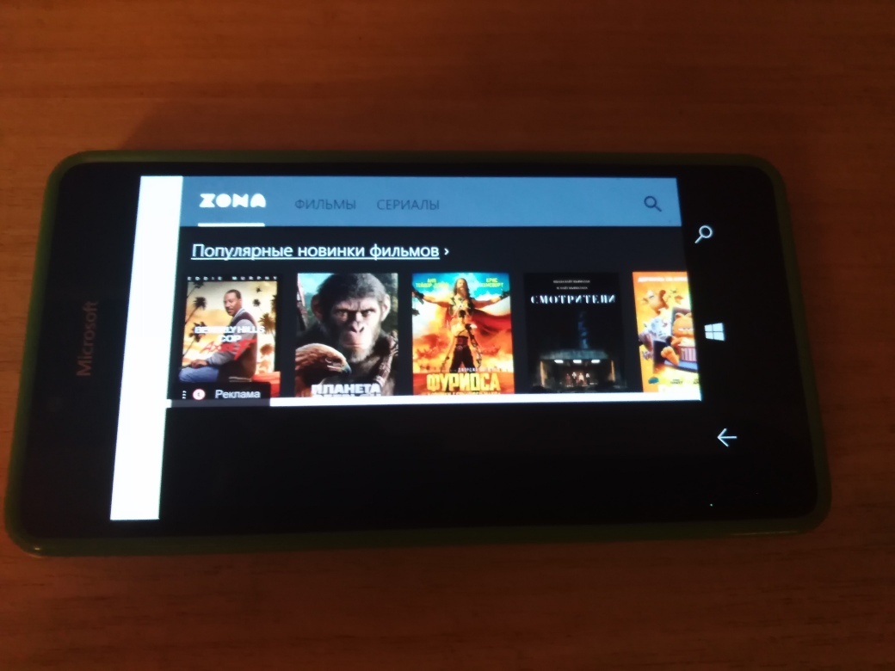

# Zona v1.0-alpha

My attempt to "recover" VPN-related Zona uwp app by simplest PWA dev. My main goal: no VPN! :)

## About
Simplest UWP pseudo-PWA app to display Zona web site on "winphone" with Windows 10 Mobile.

## Screenshots

## Tech/dev details
- Platforms: UWP
- Targets: ARM
- OS: Windows 10 (Mobile)
- Min. Win. os build: 10240 (Hello, Project Astoria!)

## Status
- Draft. Prototype / Alpha version.
- "Web parsing" not realized yet ... so, no push notifications, etc.

## Credits / Thanks
- [jetspiking](https://github.com/jetspiking) for very 
  handy & useful [WebWhatsApp](https://github.com/jetspiking/WindowsPhone_WebWhatsApp) repo used as app template

## Licensing
MIT License

## ..
AS IS. No support. RnD only / DIY

## .
[m][e] 2024
